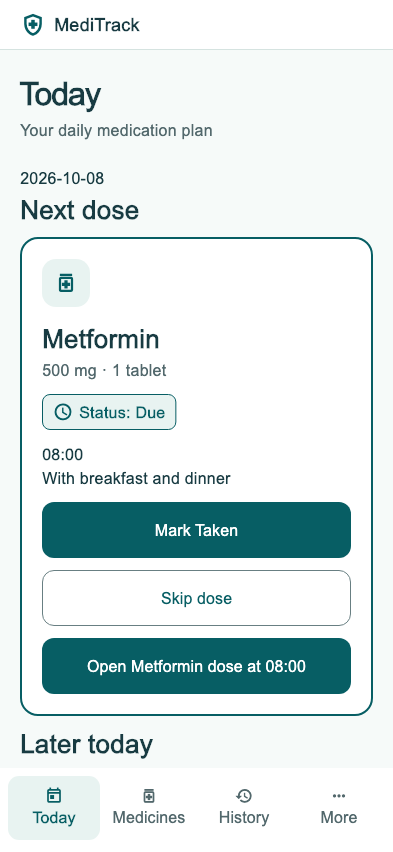

# MediTrack

A self-contained Flutter prototype for managing medicines, recording doses and symptoms, and preparing an appointment summary. Ten core screens follow the supplied MediTrack HTML design. All records stay on the current device.

**Prototype only: use sample data.** Local storage is unencrypted; notifications, cloud sync and external sharing are not connected. See [limitations](docs/LIMITATIONS.md).

## Start here

Install **Flutter 3.47.5** (includes Dart 3.13.4), Git, and Python 3.10 or newer. The exact Flutter version is recorded in `.flutter-version`; dependencies are pinned in `pubspec.lock`. Add Flutter's `bin` directory to your PATH. Chrome is the simplest way to try the app; no Android SDK or Xcode is needed for the web version.

After cloning this repository, open its root folder (the one containing `pubspec.yaml`):

```sh
flutter doctor
flutter pub get --enforce-lockfile
flutter run -d chrome
```

Start with **Add medicine**. Enter sample details, daily times such as `08:00, 18:00`, then review and save. Today supports Taken, Skip and Undo; History lets you correct saved records. More opens symptoms, summaries and larger-text settings. The app starts empty so demonstration records cannot be mistaken for personal records.

To run on an Android emulator or iOS simulator, complete that platform's setup reported by `flutter doctor`, start the emulator/simulator, run `flutter devices`, then `flutter run -d DEVICE_ID`. iOS requires macOS and Xcode. Native builds have not been verified in this repository's current validation.

## Run all checks

```sh
python3 tool/verify.py --web
```

On Windows use `python` instead of `python3`. The helper works from any directory, checks the Flutter version, restores locked dependencies, verifies Dart formatting, runs static analysis and tests, enforces **at least 60% application line coverage**, and builds the web release. Omit `--web` for faster checks while editing.

Run individual checks directly:

```sh
flutter test test/unit
flutter test test/widget
flutter test --coverage
python3 tool/coverage_report.py
flutter analyze
flutter build web --release
```

Open `reports/coverage.html` for a line-by-line report. `coverage/lcov.info` is available for coverage tools. Generated output is ignored by Git and is recreated by the verification command. [Testing details and verified results](docs/TESTING.md).

## Repository layout

```text
.github/workflows/ci.yml    GitHub pull-request and main-branch checks
lib/
  main.dart                App startup and persistence initialization
  app.dart                 Theme, text scaling and root application
  models/                  Medicine data model and serialization
  state/                   ChangeNotifier store and local persistence
  screens/                 Individual screens and navigation shell
  widgets/                 Shared design components and dose controls
test/
  unit/                    Store, persistence and date-filter tests
  widget/                  Startup, navigation, forms and accessibility tests
  support/                 Shared sample data and fixed-clock fixtures
tool/                      Cross-platform verification and report helpers
docs/
  design/reference/        Copied HTML, tokens and project references
  design/DESIGN_PARITY.md  Mapping from HTML to Flutter and deviations
  images/                  Checked-in sample phone preview
android/ ios/ web/         Platform launch projects
pubspec.yaml               App dependencies and SDK constraints
pubspec.lock               Exact dependency versions
```

Read the [architecture](docs/ARCHITECTURE.md), [design mapping](docs/design/DESIGN_PARITY.md), [contribution guide](CONTRIBUTING.md), and [GitHub publishing instructions](docs/GITHUB.md).

## GitHub automation

The workflow runs the same verification helper on pull requests, pushes to `main`, and manual dispatch. It downloads the pinned Flutter SDK from the official Flutter repository, requires read-only repository permissions, and uploads coverage reports and the compiled web app as artifacts. No custom secrets or paid coverage service are required. The workflow is prepared for GitHub but has not run there yet; local checks and a clean-copy check are documented separately.

## Reference preview

Open `docs/design/reference/index.html` in a browser to inspect the supplied interactive design. These files are copied reference material; the original synced files outside this repository were not changed. One source was unavailable in the original project mirror.



No new license has been assigned. Repository owners should choose licensing before public distribution, including rights to the supplied design/reference files.
